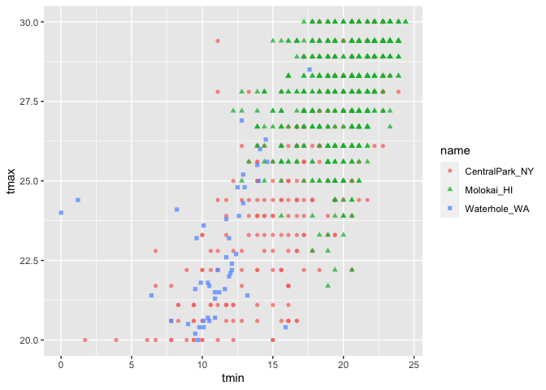
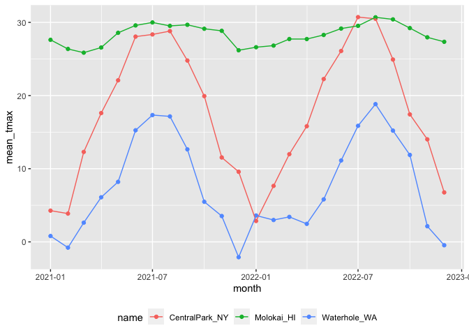
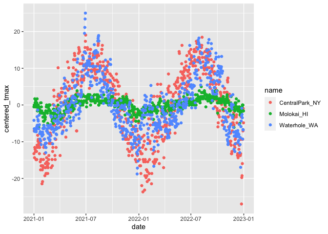

Viz part 1
================

``` r
library(tidyverse)
```

    ## ── Attaching core tidyverse packages ──────────────────────── tidyverse 2.0.0 ──
    ## ✔ dplyr     1.1.3     ✔ readr     2.1.4
    ## ✔ forcats   1.0.0     ✔ stringr   1.5.0
    ## ✔ ggplot2   3.4.3     ✔ tibble    3.2.1
    ## ✔ lubridate 1.9.2     ✔ tidyr     1.3.0
    ## ✔ purrr     1.0.2     
    ## ── Conflicts ────────────────────────────────────────── tidyverse_conflicts() ──
    ## ✖ dplyr::filter() masks stats::filter()
    ## ✖ dplyr::lag()    masks stats::lag()
    ## ℹ Use the conflicted package (<http://conflicted.r-lib.org/>) to force all conflicts to become errors

``` r
library(ggridges)
library(patchwork)

# knitr::opts_chunk$set(
#   fig.width = 6,
#   fig.asp = .6,
#   out.width = "90%"
# )
```

``` r
weather_df = 
  rnoaa::meteo_pull_monitors(
    c("USW00094728", "USW00022534", "USS0023B17S"),
    var = c("PRCP", "TMIN", "TMAX"), 
    date_min = "2021-01-01",
    date_max = "2022-12-31") |>
  mutate(
    name = recode(
      id, 
      USW00094728 = "CentralPark_NY", 
      USW00022534 = "Molokai_HI",
      USS0023B17S = "Waterhole_WA"),
    tmin = tmin / 10,
    tmax = tmax / 10,
    month = lubridate::floor_date(date, unit = "month")) |>
  select(name, id, everything())
```

    ## using cached file: /Users/yukijoyama/Library/Caches/org.R-project.R/R/rnoaa/noaa_ghcnd/USW00094728.dly

    ## date created (size, mb): 2023-09-29 16:47:58.103459 (8.525)

    ## file min/max dates: 1869-01-01 / 2023-09-30

    ## using cached file: /Users/yukijoyama/Library/Caches/org.R-project.R/R/rnoaa/noaa_ghcnd/USW00022534.dly

    ## date created (size, mb): 2023-09-29 16:48:04.258248 (3.83)

    ## file min/max dates: 1949-10-01 / 2023-09-30

    ## using cached file: /Users/yukijoyama/Library/Caches/org.R-project.R/R/rnoaa/noaa_ghcnd/USS0023B17S.dly

    ## date created (size, mb): 2023-09-29 16:48:06.693865 (0.994)

    ## file min/max dates: 1999-09-01 / 2023-09-30

## Initial numeric work

``` r
weather_df |> 
  ggplot(aes(x = prcp)) +
  geom_histogram()
```

    ## `stat_bin()` using `bins = 30`. Pick better value with `binwidth`.

    ## Warning: Removed 15 rows containing non-finite values (`stat_bin()`).

<!-- -->

here are the big outliers

``` r
weather_df |> 
  filter(prcp > 1000) 
```

    ## # A tibble: 3 × 7
    ##   name           id          date        prcp  tmax  tmin month     
    ##   <chr>          <chr>       <date>     <dbl> <dbl> <dbl> <date>    
    ## 1 CentralPark_NY USW00094728 2021-08-21  1130  27.8  22.8 2021-08-01
    ## 2 CentralPark_NY USW00094728 2021-09-01  1811  25.6  17.2 2021-09-01
    ## 3 Molokai_HI     USW00022534 2022-12-18  1120  23.3  18.9 2022-12-01

``` r
weather_df |> 
  filter(tmax >= 20, tmax <= 30) |> 
  ggplot(aes(x = tmin, y = tmax, color = name, shape = name)) + 
  geom_point(alpha = .75)
```

<!-- -->

## Grouping

``` r
weather_df |> 
  group_by(name, month)
```

    ## # A tibble: 2,190 × 7
    ## # Groups:   name, month [72]
    ##    name           id          date        prcp  tmax  tmin month     
    ##    <chr>          <chr>       <date>     <dbl> <dbl> <dbl> <date>    
    ##  1 CentralPark_NY USW00094728 2021-01-01   157   4.4   0.6 2021-01-01
    ##  2 CentralPark_NY USW00094728 2021-01-02    13  10.6   2.2 2021-01-01
    ##  3 CentralPark_NY USW00094728 2021-01-03    56   3.3   1.1 2021-01-01
    ##  4 CentralPark_NY USW00094728 2021-01-04     5   6.1   1.7 2021-01-01
    ##  5 CentralPark_NY USW00094728 2021-01-05     0   5.6   2.2 2021-01-01
    ##  6 CentralPark_NY USW00094728 2021-01-06     0   5     1.1 2021-01-01
    ##  7 CentralPark_NY USW00094728 2021-01-07     0   5    -1   2021-01-01
    ##  8 CentralPark_NY USW00094728 2021-01-08     0   2.8  -2.7 2021-01-01
    ##  9 CentralPark_NY USW00094728 2021-01-09     0   2.8  -4.3 2021-01-01
    ## 10 CentralPark_NY USW00094728 2021-01-10     0   5    -1.6 2021-01-01
    ## # ℹ 2,180 more rows

## Counting

``` r
weather_df |> 
  group_by(name, month) |> 
  summarise(n_obs = n())
```

    ## `summarise()` has grouped output by 'name'. You can override using the
    ## `.groups` argument.

    ## # A tibble: 72 × 3
    ## # Groups:   name [3]
    ##    name           month      n_obs
    ##    <chr>          <date>     <int>
    ##  1 CentralPark_NY 2021-01-01    31
    ##  2 CentralPark_NY 2021-02-01    28
    ##  3 CentralPark_NY 2021-03-01    31
    ##  4 CentralPark_NY 2021-04-01    30
    ##  5 CentralPark_NY 2021-05-01    31
    ##  6 CentralPark_NY 2021-06-01    30
    ##  7 CentralPark_NY 2021-07-01    31
    ##  8 CentralPark_NY 2021-08-01    31
    ##  9 CentralPark_NY 2021-09-01    30
    ## 10 CentralPark_NY 2021-10-01    31
    ## # ℹ 62 more rows

``` r
weather_df |> 
  group_by(month) |> 
  summarise(n_obs = n())
```

    ## # A tibble: 24 × 2
    ##    month      n_obs
    ##    <date>     <int>
    ##  1 2021-01-01    93
    ##  2 2021-02-01    84
    ##  3 2021-03-01    93
    ##  4 2021-04-01    90
    ##  5 2021-05-01    93
    ##  6 2021-06-01    90
    ##  7 2021-07-01    93
    ##  8 2021-08-01    93
    ##  9 2021-09-01    90
    ## 10 2021-10-01    93
    ## # ℹ 14 more rows

``` r
weather_df |> 
  count(name, name = "n_obs")
```

    ## # A tibble: 3 × 2
    ##   name           n_obs
    ##   <chr>          <int>
    ## 1 CentralPark_NY   730
    ## 2 Molokai_HI       730
    ## 3 Waterhole_WA     730

``` r
weather_df |> 
  count(name, month) |> 
  pivot_wider(
    names_from = name,
    values_from = n
  )
```

    ## # A tibble: 24 × 4
    ##    month      CentralPark_NY Molokai_HI Waterhole_WA
    ##    <date>              <int>      <int>        <int>
    ##  1 2021-01-01             31         31           31
    ##  2 2021-02-01             28         28           28
    ##  3 2021-03-01             31         31           31
    ##  4 2021-04-01             30         30           30
    ##  5 2021-05-01             31         31           31
    ##  6 2021-06-01             30         30           30
    ##  7 2021-07-01             31         31           31
    ##  8 2021-08-01             31         31           31
    ##  9 2021-09-01             30         30           30
    ## 10 2021-10-01             31         31           31
    ## # ℹ 14 more rows

## General summaries

``` r
weather_df |> 
  # drop_na(tmax) |> 
  group_by(name, month) |> 
  summarize(
    mean_tmax = mean(tmax, na.rm = T),
    median_tmax = median(tmax, na.rm = T),
    sd_tmax = sd(tmax, na.rm = T)
  )
```

    ## `summarise()` has grouped output by 'name'. You can override using the
    ## `.groups` argument.

    ## # A tibble: 72 × 5
    ## # Groups:   name [3]
    ##    name           month      mean_tmax median_tmax sd_tmax
    ##    <chr>          <date>         <dbl>       <dbl>   <dbl>
    ##  1 CentralPark_NY 2021-01-01      4.27         5      3.34
    ##  2 CentralPark_NY 2021-02-01      3.87         2.8    3.99
    ##  3 CentralPark_NY 2021-03-01     12.3         12.2    6.91
    ##  4 CentralPark_NY 2021-04-01     17.6         18.0    5.26
    ##  5 CentralPark_NY 2021-05-01     22.1         22.2    5.63
    ##  6 CentralPark_NY 2021-06-01     28.1         27.8    4.32
    ##  7 CentralPark_NY 2021-07-01     28.4         28.3    3.17
    ##  8 CentralPark_NY 2021-08-01     28.8         28.3    2.95
    ##  9 CentralPark_NY 2021-09-01     24.8         24.4    2.52
    ## 10 CentralPark_NY 2021-10-01     19.9         20.6    3.66
    ## # ℹ 62 more rows

``` r
weather_df |>
  group_by(name, month) |>
  summarize(mean_tmax = mean(tmax, na.rm = TRUE)) |>
  ggplot(aes(x = month, y = mean_tmax, color = name)) + 
  geom_point() + geom_line() + 
  theme(legend.position = "bottom")
```

    ## `summarise()` has grouped output by 'name'. You can override using the
    ## `.groups` argument.

<!-- -->

``` r
weather_df |>
  group_by(name, month) |>
  summarize(mean_tmax = mean(tmax, na.rm = TRUE)) |> 
  pivot_wider(
    names_from = name,
    values_from = mean_tmax) |> 
  knitr::kable(digits = 1)
```

    ## `summarise()` has grouped output by 'name'. You can override using the
    ## `.groups` argument.

| month      | CentralPark_NY | Molokai_HI | Waterhole_WA |
|:-----------|---------------:|-----------:|-------------:|
| 2021-01-01 |            4.3 |       27.6 |          0.8 |
| 2021-02-01 |            3.9 |       26.4 |         -0.8 |
| 2021-03-01 |           12.3 |       25.9 |          2.6 |
| 2021-04-01 |           17.6 |       26.6 |          6.1 |
| 2021-05-01 |           22.1 |       28.6 |          8.2 |
| 2021-06-01 |           28.1 |       29.6 |         15.3 |
| 2021-07-01 |           28.4 |       30.0 |         17.3 |
| 2021-08-01 |           28.8 |       29.5 |         17.2 |
| 2021-09-01 |           24.8 |       29.7 |         12.6 |
| 2021-10-01 |           19.9 |       29.1 |          5.5 |
| 2021-11-01 |           11.5 |       28.8 |          3.5 |
| 2021-12-01 |            9.6 |       26.2 |         -2.1 |
| 2022-01-01 |            2.9 |       26.6 |          3.6 |
| 2022-02-01 |            7.7 |       26.8 |          3.0 |
| 2022-03-01 |           12.0 |       27.7 |          3.4 |
| 2022-04-01 |           15.8 |       27.7 |          2.5 |
| 2022-05-01 |           22.3 |       28.3 |          5.8 |
| 2022-06-01 |           26.1 |       29.2 |         11.1 |
| 2022-07-01 |           30.7 |       29.5 |         15.9 |
| 2022-08-01 |           30.5 |       30.7 |         18.8 |
| 2022-09-01 |           24.9 |       30.4 |         15.2 |
| 2022-10-01 |           17.4 |       29.2 |         11.9 |
| 2022-11-01 |           14.0 |       28.0 |          2.1 |
| 2022-12-01 |            6.8 |       27.3 |         -0.5 |

``` r
weather_df |>
  group_by(name) |>
  mutate(
    mean_tmax = mean(tmax, na.rm = TRUE),
    centered_tmax = tmax - mean_tmax) |> 
  ggplot(aes(x = date, y = centered_tmax, color = name)) + 
    geom_point() 
```

    ## Warning: Removed 17 rows containing missing values (`geom_point()`).

<!-- -->

``` r
## Warning: Removed 17 rows containing missing values (`geom_point()`).
```

``` r
weather_df |>
  group_by(name, month) |>
  mutate(temp_ranking = min_rank(tmax))
```

    ## # A tibble: 2,190 × 8
    ## # Groups:   name, month [72]
    ##    name           id        date        prcp  tmax  tmin month      temp_ranking
    ##    <chr>          <chr>     <date>     <dbl> <dbl> <dbl> <date>            <int>
    ##  1 CentralPark_NY USW00094… 2021-01-01   157   4.4   0.6 2021-01-01           14
    ##  2 CentralPark_NY USW00094… 2021-01-02    13  10.6   2.2 2021-01-01           31
    ##  3 CentralPark_NY USW00094… 2021-01-03    56   3.3   1.1 2021-01-01           13
    ##  4 CentralPark_NY USW00094… 2021-01-04     5   6.1   1.7 2021-01-01           20
    ##  5 CentralPark_NY USW00094… 2021-01-05     0   5.6   2.2 2021-01-01           19
    ##  6 CentralPark_NY USW00094… 2021-01-06     0   5     1.1 2021-01-01           16
    ##  7 CentralPark_NY USW00094… 2021-01-07     0   5    -1   2021-01-01           16
    ##  8 CentralPark_NY USW00094… 2021-01-08     0   2.8  -2.7 2021-01-01            8
    ##  9 CentralPark_NY USW00094… 2021-01-09     0   2.8  -4.3 2021-01-01            8
    ## 10 CentralPark_NY USW00094… 2021-01-10     0   5    -1.6 2021-01-01           16
    ## # ℹ 2,180 more rows

``` r
weather_df |>
  group_by(name, month) |>
  filter(min_rank(tmax) < 2)
```

    ## # A tibble: 92 × 7
    ## # Groups:   name, month [72]
    ##    name           id          date        prcp  tmax  tmin month     
    ##    <chr>          <chr>       <date>     <dbl> <dbl> <dbl> <date>    
    ##  1 CentralPark_NY USW00094728 2021-01-29     0  -3.8  -9.9 2021-01-01
    ##  2 CentralPark_NY USW00094728 2021-02-08     0  -1.6  -8.2 2021-02-01
    ##  3 CentralPark_NY USW00094728 2021-03-02     0   0.6  -6   2021-03-01
    ##  4 CentralPark_NY USW00094728 2021-04-02     0   3.9  -2.1 2021-04-01
    ##  5 CentralPark_NY USW00094728 2021-05-29   117  10.6   8.3 2021-05-01
    ##  6 CentralPark_NY USW00094728 2021-05-30   226  10.6   8.3 2021-05-01
    ##  7 CentralPark_NY USW00094728 2021-06-11     0  20.6  16.7 2021-06-01
    ##  8 CentralPark_NY USW00094728 2021-06-12     0  20.6  16.7 2021-06-01
    ##  9 CentralPark_NY USW00094728 2021-07-03    86  18.9  15   2021-07-01
    ## 10 CentralPark_NY USW00094728 2021-08-04     0  24.4  19.4 2021-08-01
    ## # ℹ 82 more rows

``` r
weather_df |>
  group_by(name, month) |>
  filter(min_rank(desc(tmax)) < 4)
```

    ## # A tibble: 269 × 7
    ## # Groups:   name, month [72]
    ##    name           id          date        prcp  tmax  tmin month     
    ##    <chr>          <chr>       <date>     <dbl> <dbl> <dbl> <date>    
    ##  1 CentralPark_NY USW00094728 2021-01-02    13  10.6   2.2 2021-01-01
    ##  2 CentralPark_NY USW00094728 2021-01-14     0   9.4   3.9 2021-01-01
    ##  3 CentralPark_NY USW00094728 2021-01-16   198   8.3   2.8 2021-01-01
    ##  4 CentralPark_NY USW00094728 2021-02-16   208  10.6   1.1 2021-02-01
    ##  5 CentralPark_NY USW00094728 2021-02-24     0  12.2   3.9 2021-02-01
    ##  6 CentralPark_NY USW00094728 2021-02-25     0  10     4.4 2021-02-01
    ##  7 CentralPark_NY USW00094728 2021-02-27    99  10     3.3 2021-02-01
    ##  8 CentralPark_NY USW00094728 2021-03-11     0  21.7   6.7 2021-03-01
    ##  9 CentralPark_NY USW00094728 2021-03-26    48  27.8  11.1 2021-03-01
    ## 10 CentralPark_NY USW00094728 2021-03-27     0  20.6  10   2021-03-01
    ## # ℹ 259 more rows

``` r
weather_df |>
  group_by(name) |>
  mutate(temp_change = tmax - lag(tmax)) |>
  summarize(
    temp_change_sd = sd(temp_change, na.rm = TRUE),
    temp_change_max = max(temp_change, na.rm = TRUE))
```

    ## # A tibble: 3 × 3
    ##   name           temp_change_sd temp_change_max
    ##   <chr>                   <dbl>           <dbl>
    ## 1 CentralPark_NY           4.43            12.2
    ## 2 Molokai_HI               1.24             5.6
    ## 3 Waterhole_WA             3.04            11.1
